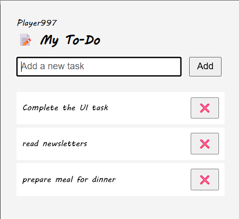

# 🧩 To-Do List Sidebar Chrome Extension

A simple and beautiful Chrome extension that helps you manage tasks efficiently from a compact popup sidebar. Add, check off, or delete your tasks quickly without leaving your current tab.

---

## 📸 Screenshot



---

## 🚀 Features

- ✅ Add new tasks
- ☑️ Mark tasks as complete/incomplete
- ❌ Delete individual tasks
- 💾 Tasks are stored locally using Chrome's `storage.local` API
- 🎯 Clean, minimal UI
- ⌨️ Keyboard support (press **Enter** to add a task)

---

## 📂 Folder Structure

```

todo-sidebar-extension/
├── manifest.json
├── popup.html
├── popup.css
├── popup.js
├── icon.png
└── screenshot.png

```

---

## 🔧 Installation Instructions (for Development)

1. Clone or download this repository.
2. Open [chrome://extensions](chrome://extensions) in your Chrome browser.
3. Enable **Developer mode** (top right corner).
4. Click **"Load unpacked"**.
5. Select the project folder (`todo-sidebar-extension`).
6. Click on the extension icon in the toolbar to open the To-Do List.

---

## 📌 Tech Used

- HTML, CSS, JavaScript
- Chrome Extension API (`manifest v3`)
- Local Storage (`chrome.storage.local`)

---

## 📈 Future Improvements

- Cloud sync across devices
- Deadline & reminder support
- Custom themes
- Task categories/folders

---

## 👨‍💻 Author

**Aditya Verma** – [@Player997](https://github.com/Player997)

Made with ❤️ for productivity and learning.
